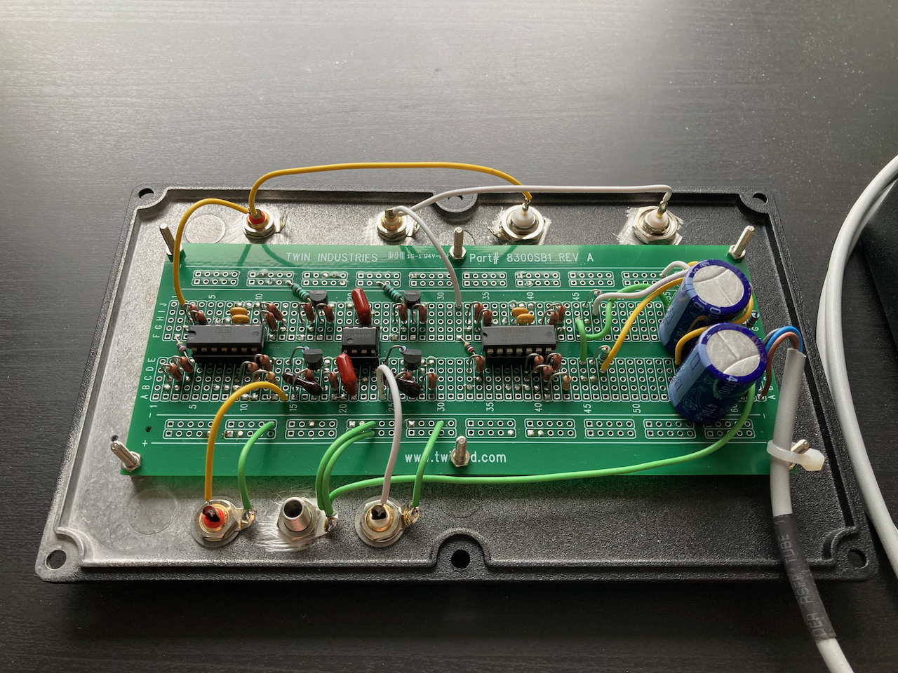
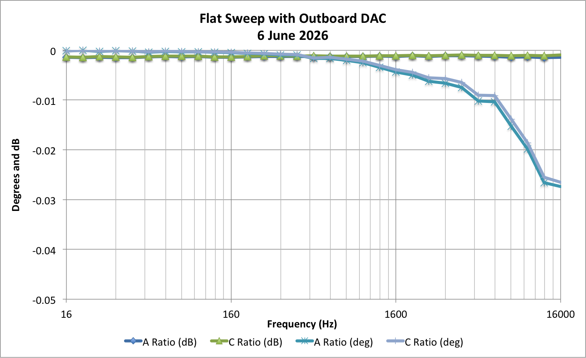

# Obtain RIAA Results
This is a landing page for the No-Trim RIAA Phono Stage project. A pre-print of that work is posted here:
- [No-Trim RIAA Stage: Employs Analog Computer](https://github.com/springleik/BodeS/blob/master/RIAApaper.pdf)

GitHub may have some trouble rendering PDFs, please download the above document and render it locally. Thanks! Following snapshot is my listening setup:


This snapshot is the insides of the RIAA phono preamp, based on the UAF42 universal active filter from Texas Instruments:



To measure performance of the RIAA deemphasis circuit I used some Python code previously developed for the AC Bridge project, which is archived in this repo. If you want to follow along, you'll need a computer with sound hardware that can also run some Python scripts. The first step is to install the _acBridge_ repo:

- [How to install and run the _acBridge_ project.](HowToInstall.md)


Then navigate to the _RIAAResponse_ folder in the _acBridge_ project:

```
MarksiMac:GitHub williamm$ cd ../RIAAResponse/
```

Next generate a stimulus wave file using the setup description file _a.json_ with two frequency sweeps, both having flat response. This may be a slow process depending on your computer, please be patient:

```
MarksiMac:RIAAResponse williamm$ ../measStim.py a b 2
Loading setup file 'a.json'
Wrote wave file 'a.wav' with 74584992 bytes of data
Writing setup file 'b.json'
```

The second argument gives the name _b_ to the augmented description file _b.json_. The optional third argument specifies mode '2' for the stimulus file, which means two tone bursts per frequency with both channels active in the first burst and both channels quiet in the second burst. Bursts are about one second long with one second intervals between, so about four seconds per frequency. The sweep is logarithmic with ten bursts per decade, covering three decades in 31 bursts, just over two minutes per sweep. The setup file _a.json_ includes two sweeps with a pause between them, so total experiment time is more than four minutes. I've posted the results from my computer here as _b.wav_, which you can replace with your own file by playing _a.wav_ and recording _b.wav_ with a straight cable connecting sound output to sound input. After recording, be sure that _b.wav_ is slightly behind _a.wav_ so its tone bursts come say 100 msec. after _a.wav_. This offset is not critical, but there must be some delay for the analysis script to work.

Analysis is performed by running another Python script:

```
MarksiMac:RIAAResponse williamm$ ../measResp.py b c 6
Loading setup file 'b.json'
Reading wave file 'b.wav'
Wave file parameters:
{
  "nchannels": 2,
  "sampwidth": 3,
  "framerate": 44100,
  "nframes": 12547203,
  "comptype": "NONE",
  "compname": "not compressed"
}
Expected 12166232 frames, found 12547203
...
```
The second argument gives the name _c_ to the analysis output description file _c.json_. The optional third argument specifies mode '6' for analysis output, which means one row of data for each data point with frequency in the first column. The remaining eight columns contain the real parts of four measurements plus the imaginary parts of four measurements. The measurements are left channel first burst, left channel second burst, right channel first burst, and right channel second burst in that order. This output can be pasted into an Excel spreadsheet to obtain the complex ratio between the first sweep and second sweep for each frequency. A worked example is posted here as _FlatSweep.xlsx_. For my computer the gain ratio is quite flat, while the phase shift is vanishingly small even at the highest frequencies. This is our assurance that the two sweeps of stimulus and response occur with the same sample clock, which is required for measuring the RIAA response with this technique.



Now we are ready for the actual RIAA response measurement. For this we use a specially prepared stimulus wave file _d.wav_ with two different frequency sweeps. The first sweep is flat and is used to capture the "straight wire" response without connecting the RIAA stage. The second sweep has the phase and amplitude of each tone burst modified by the RIAA preemphasis curve and is used to capture the transfer function response of the RIAA stage. If the digital preemphasis curve and analog deemphasis curve are the exact inverse of each other, then the overall response should be perfectly flat. What we actually find is that the overall response is not flat, but rather shows everything not accounted for in the RIAA standard.
