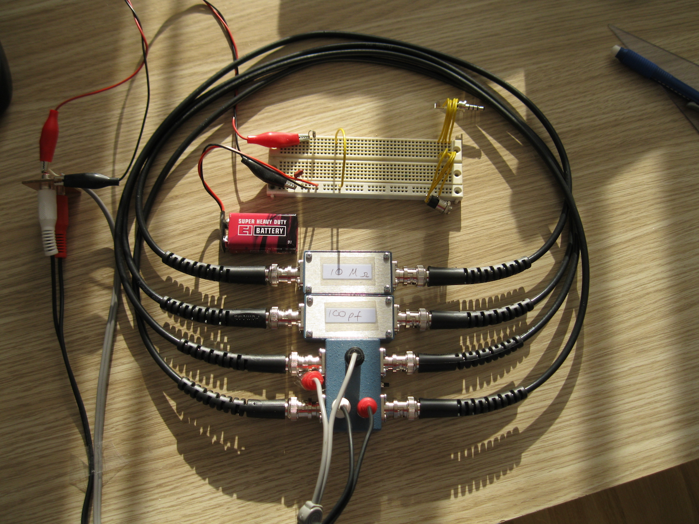

# acBridge
This project contains the Python scripts used to implement a stimulus response experiment for comparing electrical impedances, as described in my paper "Digitizing Bridge Measures RC Time Constants" in the IEEE Transactions on Instrumentation and Measurement, vol. 75, pp. 1-8, 2026, doi: [10.1109/TIM.2026.3670597](https://doi.org/10.1109/TIM.2026.3670597).

I've posted some instructions here to install and run the project locally.
- [How to install and run the _acBridge_ project.](HowToInstall.md)
